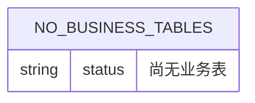

# Schema 鸟瞰图

> 最后更新：2026-08-27  
> Hasura CLI：v2.49.5  
> 状态：**尚无业务表**；Postgres 数据源尚未在 Hasura metadata 中配置

## 说明

当前远程 Hasura 实例已接入，但 `public` schema 下尚未 track 任何业务表。

## ER 图

```mermaid
erDiagram
  NO_BUSINESS_TABLES {
    string status "尚无业务表"
  }
```
