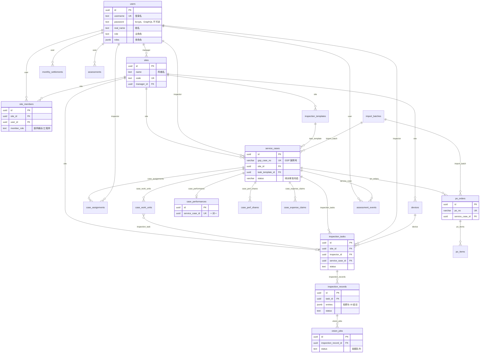

# Schema 鸟瞰图

> 最后更新：2026-08-27 21:58  
> Hasura CLI：v2.49.5  
> 数据源：`default`（Postgres `public`）  
> 状态：已 track 25 张业务表；关系均来自 FK（`foreign_key_constraint_on`）

请对照 Console http://localhost:9695 与本图：漏表、关系反了请立刻说。

## 已 track 表

`users` `sites` `site_members` `devices` `inspection_templates` `import_batches` `service_cases` `case_assignments` `case_work_units` `inspection_tasks` `inspection_records` `vision_jobs` `ai_hard_rules` `case_expense_claims` `po_orders` `po_items` `price_library` `item_price_mappings` `case_performances` `case_perf_shares` `assessments` `assessment_events` `assessment_score_rules` `monthly_settlements` `change_logs`

## JWT 角色

| 角色 | 含义 |
|---|---|
| `super_admin` | 全表 |
| `site_manager` | 本网格及成员范围 |
| `inspector` | 本人任务 / 派单 / 报销 |
| 无 Token | `anonymous`，无业务权限 |

`users.password` 仅 insert/update，select 不可见。登录由 Next 服务端用 Admin Secret 查哈希后签发 JWT。

## ER 图（核心闭环 + 财务）

关系名与 metadata 中 `object_relationships` / `array_relationships` 一致。指向 `users` 的多条 FK 使用列名去 `_id` 后的关系名（如 `created_by`、`inspector`、`manager`）。

## GraphQL

- `https://hs-kofdlduv.jzsdqp.weweknow.com/v1/graphql`
- 浏览器：`Authorization: Bearer <jwt>`
- 默认复数：`service_cases` / `insert_service_cases_one`
